<!-- markdownlint-disable-file -->
# Task Checklist: Azure OpenAI GPT Realtime Chatbot Implementation

## Overview

Build a Single Page Application (SPA) with React 18+, TypeScript, and Vite that provides a chatbot interface to Azure OpenAI GPT Realtime model with both text and real-time voice interaction capabilities, using MSAL.js for RBAC authentication and Web Audio API for voice processing.

## Objectives

* Create production-ready React SPA with authentication, text chat, and voice capabilities
* Implement secure RBAC authentication using MSAL.js with automatic token refresh
* Integrate Azure OpenAI Realtime API for text and voice interactions
* Achieve 80%+ test coverage for business logic with comprehensive E2E testing
* Deliver responsive UI working on desktop and mobile devices

## Research Summary

### Project Files
* `/workspaces/realtime-website/src/` - Current Python application root
* `/workspaces/realtime-website/pyproject.toml` - Python project configuration (uv package manager)

### External References
* `.agent-tracking/research/20260226-azure-openai-gpt-chatbot-research.md` - Comprehensive technical research including Azure OpenAI API specs, MSAL.js patterns, Web Audio API implementation, and complete code examples
* `.agent-tracking/test-strategies/20260226-azure-openai-realtime-chatbot-test-strategy.md` - HYBRID testing strategy (TDD for auth/API, Code-First for UI/audio)
* GitHub: AzureAD/microsoft-authentication-library-for-js - MSAL.js React patterns and examples
* MDN Web Audio API Documentation - Audio capture, processing, and playback patterns

### Standards References
* Project conventions: Ruff formatting for Python (existing), ESLint + Prettier for TypeScript (to be established)
* Testing: Jest + React Testing Library for unit/integration, Playwright for E2E

## Task Dependency Graph

```mermaid
graph TD
    subgraph Phase1[Phase 1: Project Setup]
        T1.1[Task 1.1: Initialize React app]
        T1.2[Task 1.2: Configure TypeScript]
        T1.3[Task 1.3: Setup test infrastructure]
    end
    
    subgraph Phase2[Phase 2: Authentication - TDD]
        T2.1[Task 2.1: Write auth service tests]
        T2.2[Task 2.2: Implement MSAL.js integration]
        T2.3[Task 2.3: Create auth context]
        T2.4[Task 2.4: Build login UI]
    end
    
    subgraph Phase3[Phase 3: Azure OpenAI Integration - TDD]
        T3.1[Task 3.1: Write API service tests]
        T3.2[Task 3.2: Implement OpenAI service]
        T3.3[Task 3.3: Add rate limiting]
        T3.4[Task 3.4: Implement error handling]
    end
    
    subgraph Phase4[Phase 4: Chat UI - Code-First]
        T4.1[Task 4.1: Create chat components]
        T4.2[Task 4.2: Implement message display]
        T4.3[Task 4.3: Add text input]
        T4.4[Task 4.4: Test chat UI]
    end
    
    subgraph Phase5[Phase 5: Voice Features - Hybrid]
        T5.1[Task 5.1: Write audio tests]
        T5.2[Task 5.2: Implement audio capture]
        T5.3[Task 5.3: Add WebSocket streaming]
        T5.4[Task 5.4: Implement audio playback]
        T5.5[Task 5.5: Create voice UI]
        T5.6[Task 5.6: Test voice integration]
    end
    
    subgraph Phase6[Phase 6: Backend Token Proxy]
        T6.1[Task 6.1: Setup Azure Function]
        T6.2[Task 6.2: Implement token endpoint]
        T6.3[Task 6.3: Add CORS configuration]
        T6.4[Task 6.4: Test token flow]
    end
    
    subgraph Phase7[Phase 7: Responsive UI & Polish]
        T7.1[Task 7.1: Implement mobile layout]
        T7.2[Task 7.2: Add error boundaries]
        T7.3[Task 7.3: Optimize performance]
        T7.4[Task 7.4: Test responsive design]
    end
    
    subgraph Phase8[Phase 8: E2E Testing & Validation]
        T8.1[Task 8.1: Write Playwright tests]
        T8.2[Task 8.2: Validate coverage]
        T8.3[Task 8.3: Security audit]
        T8.4[Task 8.4: Final integration test]
    end
    
    T1.1 --> T1.2
    T1.2 --> T1.3
    T1.3 --> T2.1
    T2.1 --> T2.2
    T2.2 --> T2.3
    T2.3 --> T2.4
    T2.4 --> T3.1
    T3.1 --> T3.2
    T3.2 --> T3.3
    T3.3 --> T3.4
    T3.4 --> T4.1
    T4.1 --> T4.2
    T4.2 --> T4.3
    T4.3 --> T4.4
    T4.4 --> T5.1
    T5.1 --> T5.2
    T5.2 --> T5.3
    T5.3 --> T5.4
    T5.4 --> T5.5
    T5.5 --> T5.6
    T2.4 --> T6.1
    T6.1 --> T6.2
    T6.2 --> T6.3
    T6.3 --> T6.4
    T5.6 --> T7.1
    T6.4 --> T7.1
    T7.1 --> T7.2
    T7.2 --> T7.3
    T7.3 --> T7.4
    T7.4 --> T8.1
    T8.1 --> T8.2
    T8.2 --> T8.3
    T8.3 --> T8.4
    
    %% Critical Path highlighted
    style T1.1 fill:#ff9999
    style T2.1 fill:#ff9999
    style T2.2 fill:#ff9999
    style T3.1 fill:#ff9999
    style T3.2 fill:#ff9999
    style T4.1 fill:#ff9999
    style T5.1 fill:#ff9999
    style T5.2 fill:#ff9999
    style T8.1 fill:#ff9999
```

**Critical Path**: T1.1 → T2.1 → T2.2 → T3.1 → T3.2 → T4.1 → T5.1 → T5.2 → T8.1  
**Parallel Opportunities**: T6.1-T6.4 (backend) can run parallel to T4.1-T5.6 (frontend features) after T2.4 completes

## Implementation Checklist

### [x] Phase 1: Project Setup & Infrastructure

**Phase Objective**: Establish React SPA foundation with TypeScript, build tooling, and comprehensive test infrastructure

#### Phase Gate: Phase 1 Complete When
- [x] All Phase 1 tasks marked complete
- [x] `npm run dev` starts development server successfully
- [x] `npm test` runs Jest tests without errors
- [x] TypeScript compilation succeeds with zero errors
- [x] Validation: `cd web && npm run build && npm test`
- [x] Artifacts: `web/` directory, `package.json`, `tsconfig.json`, `jest.config.js`

**Cannot Proceed If**: Build fails, TypeScript errors present, test infrastructure not functional

* [x] Task 1.1: Initialize React 18+ application with Vite
  * Details: .agent-tracking/details/20260226-azure-openai-realtime-chatbot-details.md (Lines 15-45)
  * Dependencies: None
  * Priority: CRITICAL

* [x] Task 1.2: Configure TypeScript and project structure
  * Details: .agent-tracking/details/20260226-azure-openai-realtime-chatbot-details.md (Lines 47-82)
  * Dependencies: Task 1.1
  * Priority: CRITICAL

* [x] Task 1.3: Setup Jest + React Testing Library infrastructure
  * Details: .agent-tracking/details/20260226-azure-openai-realtime-chatbot-details.md (Lines 84-118)
  * Dependencies: Task 1.2
  * Priority: HIGH

---

### [x] Phase 2: Authentication Service (TDD Approach) ✅ COMPLETE

**Phase Objective**: Implement secure MSAL.js authentication with 95%+ test coverage before code implementation

**Test Strategy**: TDD (Tests written BEFORE implementation) - Per test strategy Lines 143-187

#### Phase Gate: Phase 2 Complete When
- [x] All Phase 2 tasks marked complete
- [x] Auth tests pass with 95%+ coverage (30 auth tests + 14 UI tests = 44 total)
- [x] User can successfully login via Azure AD
- [x] Token refresh works automatically
- [x] Validation: `npm test -- authService.test.ts && npm run dev` (login flow works)
- [x] Artifacts: `authService.ts`, `authService.test.ts`, `useAuth.ts`, `LoginButton.tsx`

**Cannot Proceed If**: Authentication tests fail, token acquisition broken, coverage <95%

* [x] Task 2.1: Write comprehensive auth service tests (TDD Phase 1)
  * Details: .agent-tracking/details/20260226-azure-openai-realtime-chatbot-details.md (Lines 120-165)
  * Dependencies: Task 1.3
  * Test Approach: TDD (per test strategy Lines 143-187)
  * Coverage Target: 95%
  * Priority: CRITICAL
  * Status: ✅ COMPLETE - 30 tests written (8 critical scenarios + 5 edge cases), all failing as expected (RED phase)

* [x] Task 2.2: Implement MSAL.js authentication service (TDD Phase 2)
  * Details: .agent-tracking/details/20260226-azure-openai-realtime-chatbot-details.md (Lines 167-208)
  * Dependencies: Task 2.1 (tests must exist first)
  * Priority: CRITICAL
  * Status: ✅ COMPLETE - All 30 tests passing (GREEN phase), auth service fully implemented

* [x] Task 2.3: Create authentication context and hooks
  * Details: .agent-tracking/details/20260226-azure-openai-realtime-chatbot-details.md (Lines 210-245)
  * Dependencies: Task 2.2
  * Priority: HIGH
  * Status: ✅ COMPLETE - AuthContext, useAuth hook, MsalProvider integration

* [x] Task 2.4: Build login/logout UI components
  * Details: .agent-tracking/details/20260226-azure-openai-realtime-chatbot-details.md (Lines 247-278)
  * Dependencies: Task 2.3
  * Test Approach: Code-First (UI components)
  * Coverage Target: 60%
  * Priority: HIGH
  * Status: ✅ COMPLETE - LoginButton, AppLayout components with 14 tests passing

---

### [ ] Phase 3: Azure OpenAI Service Integration (TDD Approach)

**Phase Objective**: Implement Azure OpenAI API client with robust error handling and 90%+ test coverage

**Test Strategy**: TDD (Tests written BEFORE implementation) - Per test strategy Lines 188-228

#### Phase Gate: Phase 3 Complete When
- [ ] All Phase 3 tasks marked complete
- [ ] API service tests pass with 90%+ coverage
- [ ] Text messages send/receive successfully
- [ ] Rate limiting and error handling work
- [ ] Validation: `npm test -- openaiService.test.ts` (all tests pass)
- [ ] Artifacts: `openaiService.ts`, `openaiService.test.ts`, rate limiting logic

**Cannot Proceed If**: API tests fail, rate limiting broken, coverage <90%

* [ ] Task 3.1: Write Azure OpenAI service tests (TDD Phase 1)
  * Details: .agent-tracking/details/20260226-azure-openai-realtime-chatbot-details.md (Lines 280-325)
  * Dependencies: Task 2.2 (needs auth token access)
  * Test Approach: TDD (per test strategy Lines 188-228)
  * Coverage Target: 90%
  * Priority: CRITICAL

* [ ] Task 3.2: Implement Azure OpenAI SDK wrapper service (TDD Phase 2)
  * Details: .agent-tracking/details/20260226-azure-openai-realtime-chatbot-details.md (Lines 327-368)
  * Dependencies: Task 3.1 (tests must exist first)
  * Priority: CRITICAL

* [ ] Task 3.3: Add rate limiting and request queue
  * Details: .agent-tracking/details/20260226-azure-openai-realtime-chatbot-details.md (Lines 370-405)
  * Dependencies: Task 3.2
  * Priority: HIGH

* [ ] Task 3.4: Implement comprehensive error handling
  * Details: .agent-tracking/details/20260226-azure-openai-realtime-chatbot-details.md (Lines 407-442)
  * Dependencies: Task 3.3
  * Priority: HIGH

---

### [ ] Phase 4: Chat Interface Components (Code-First Approach)

**Phase Objective**: Build responsive chat UI with message display and text input, achieving 60%+ component coverage

**Test Strategy**: Code-First (Build UI first, tests after) - Per test strategy Lines 281-322

#### Phase Gate: Phase 4 Complete When
- [ ] All Phase 4 tasks marked complete
- [ ] Chat UI renders correctly on desktop and mobile
- [ ] Messages send and display properly
- [ ] Component tests pass with 60%+ coverage
- [ ] Validation: `npm run dev` (manual chat test) + `npm test -- Chat.test.tsx`
- [ ] Artifacts: Chat components, ChatContext, component tests

**Cannot Proceed If**: UI broken, messages not displaying, component tests fail

* [ ] Task 4.1: Create chat container and message list components
  * Details: .agent-tracking/details/20260226-azure-openai-realtime-chatbot-details.md (Lines 444-485)
  * Dependencies: Task 3.2 (needs OpenAI service)
  * Test Approach: Code-First (per test strategy Lines 281-322)
  * Priority: HIGH

* [ ] Task 4.2: Implement message rendering with markdown support
  * Details: .agent-tracking/details/20260226-azure-openai-realtime-chatbot-details.md (Lines 487-520)
  * Dependencies: Task 4.1
  * Priority: MEDIUM

* [ ] Task 4.3: Build message input component with send functionality
  * Details: .agent-tracking/details/20260226-azure-openai-realtime-chatbot-details.md (Lines 522-558)
  * Dependencies: Task 4.2
  * Priority: HIGH

* [ ] Task 4.4: Write component tests for chat UI (Code-First Phase 2)
  * Details: .agent-tracking/details/20260226-azure-openai-realtime-chatbot-details.md (Lines 560-592)
  * Dependencies: Tasks 4.1, 4.2, 4.3 (implementation complete first)
  * Test Approach: Code-First (tests after implementation)
  * Coverage Target: 60%
  * Priority: MEDIUM

---

### [ ] Phase 5: Voice Interaction Features (Hybrid Approach)

**Phase Objective**: Implement real-time voice capture, streaming, and playback with <500ms latency target

**Test Strategy**: HYBRID (TDD for audio service core logic, Code-First for UI and exploratory audio optimization) - Per test strategy Lines 231-278

#### Phase Gate: Phase 5 Complete When
- [ ] All Phase 5 tasks marked complete
- [ ] Voice recording starts within 100ms of button press
- [ ] Voice streaming to Azure OpenAI works via WebSocket
- [ ] Audio playback works with <500ms latency
- [ ] Audio service tests pass with 70%+ coverage
- [ ] Validation: Manual E2E test (record → stream → playback) + `npm test -- audioService.test.ts`
- [ ] Artifacts: Audio service, voice UI components, WebSocket handler

**Cannot Proceed If**: Microphone permission fails, WebSocket connection broken, audio playback broken

* [ ] Task 5.1: Write audio service tests for critical logic (TDD Phase 1)
  * Details: .agent-tracking/details/20260226-azure-openai-realtime-chatbot-details.md (Lines 594-638)
  * Dependencies: Task 1.3 (test infrastructure with jest-webaudio-mock)
  * Test Approach: TDD for core logic (per test strategy Lines 231-278)
  * Coverage Target: 70%
  * Priority: HIGH

* [ ] Task 5.2: Implement audio capture with Web Audio API (Hybrid)
  * Details: .agent-tracking/details/20260226-azure-openai-realtime-chatbot-details.md (Lines 640-688)
  * Dependencies: Task 5.1 (tests for state machine)
  * Test Approach: TDD for state logic, exploratory for buffer optimization
  * Priority: CRITICAL

* [ ] Task 5.3: Add WebSocket streaming for voice data
  * Details: .agent-tracking/details/20260226-azure-openai-realtime-chatbot-details.md (Lines 690-730)
  * Dependencies: Task 5.2
  * Priority: CRITICAL

* [ ] Task 5.4: Implement audio playback and buffering
  * Details: .agent-tracking/details/20260226-azure-openai-realtime-chatbot-details.md (Lines 732-770)
  * Dependencies: Task 5.3
  * Priority: HIGH

* [ ] Task 5.5: Create voice toggle UI components (Code-First)
  * Details: .agent-tracking/details/20260226-azure-openai-realtime-chatbot-details.md (Lines 772-808)
  * Dependencies: Task 5.4
  * Test Approach: Code-First (UI exploration)
  * Priority: MEDIUM

* [ ] Task 5.6: Write integration tests for voice workflow
  * Details: .agent-tracking/details/20260226-azure-openai-realtime-chatbot-details.md (Lines 810-845)
  * Dependencies: Tasks 5.2, 5.3, 5.4, 5.5 (voice features complete)
  * Priority: MEDIUM

---

### [ ] Phase 6: Backend Token Proxy (TDD Approach)

**Phase Objective**: Create lightweight Azure Function for secure token acquisition with CORS support

**Test Strategy**: TDD - Per test strategy component assessment (security-critical)

**Note**: This phase can run in PARALLEL with Phase 4-5 after Phase 2 completes

#### Phase Gate: Phase 6 Complete When
- [ ] All Phase 6 tasks marked complete
- [ ] Azure Function deploys and responds to requests
- [ ] Token endpoint returns valid Azure OpenAI tokens
- [ ] CORS configured correctly for SPA origin
- [ ] Validation: `curl http://localhost:7071/api/token` (returns token) + frontend integration test
- [ ] Artifacts: Azure Function code, function.json, CORS config

**Cannot Proceed If**: Token endpoint returns errors, CORS blocks frontend, authentication fails

* [ ] Task 6.1: Initialize Azure Function project with TypeScript
  * Details: .agent-tracking/details/20260226-azure-openai-realtime-chatbot-details.md (Lines 847-880)
  * Dependencies: Task 2.4 (auth flow understood)
  * Priority: HIGH

* [ ] Task 6.2: Implement token acquisition endpoint with tests (TDD)
  * Details: .agent-tracking/details/20260226-azure-openai-realtime-chatbot-details.md (Lines 882-925)
  * Dependencies: Task 6.1
  * Test Approach: TDD (security-critical)
  * Coverage Target: 95%
  * Priority: CRITICAL

* [ ] Task 6.3: Configure CORS and security headers
  * Details: .agent-tracking/details/20260226-azure-openai-realtime-chatbot-details.md (Lines 927-960)
  * Dependencies: Task 6.2
  * Priority: HIGH

* [ ] Task 6.4: Test token proxy integration with frontend
  * Details: .agent-tracking/details/20260226-azure-openai-realtime-chatbot-details.md (Lines 962-995)
  * Dependencies: Task 6.3, Task 3.2 (frontend OpenAI service)
  * Priority: HIGH

---

### [ ] Phase 7: Responsive UI & Polish

**Phase Objective**: Optimize UI for mobile devices, add error boundaries, and improve performance

**Test Strategy**: Code-First with manual testing

#### Phase Gate: Phase 7 Complete When
- [ ] All Phase 7 tasks marked complete
- [ ] Mobile layout works on devices <768px width
- [ ] Error boundaries catch and display errors gracefully
- [ ] Performance metrics meet targets (<3s page load, <500ms voice latency)
- [ ] Validation: Manual testing on mobile/desktop + Lighthouse audit
- [ ] Artifacts: Responsive CSS, ErrorBoundary component, performance optimizations

**Cannot Proceed If**: Mobile layout broken, error boundaries not catching errors, performance below targets

* [ ] Task 7.1: Implement responsive mobile layout
  * Details: .agent-tracking/details/20260226-azure-openai-realtime-chatbot-details.md (Lines 997-1035)
  * Dependencies: Tasks 4.3, 5.5 (all UI components exist)
  * Test Approach: Manual testing + visual regression
  * Priority: MEDIUM

* [ ] Task 7.2: Add error boundaries and fallback UI
  * Details: .agent-tracking/details/20260226-azure-openai-realtime-chatbot-details.md (Lines 1037-1070)
  * Dependencies: All Phase 4-5 tasks
  * Priority: HIGH

* [ ] Task 7.3: Optimize bundle size and loading performance
  * Details: .agent-tracking/details/20260226-azure-openai-realtime-chatbot-details.md (Lines 1072-1105)
  * Dependencies: Task 7.2
  * Priority: MEDIUM

* [ ] Task 7.4: Test responsive design across devices
  * Details: .agent-tracking/details/20260226-azure-openai-realtime-chatbot-details.md (Lines 1107-1138)
  * Dependencies: Tasks 7.1, 7.2, 7.3
  * Priority: MEDIUM

---

### [ ] Phase 8: End-to-End Testing & Final Validation

**Phase Objective**: Validate complete user flows with Playwright E2E tests and ensure all success criteria are met

**Test Strategy**: E2E Testing with Playwright - Per test strategy Lines 378-432

#### Phase Gate: Phase 8 Complete When
- [ ] All Phase 8 tasks marked complete
- [ ] E2E tests pass for all critical user flows
- [ ] Test coverage meets targets (80% business logic, 60% components)
- [ ] Security audit identifies no critical issues
- [ ] All objective success criteria validated
- [ ] Validation: `npm run test:e2e && npm test -- --coverage`
- [ ] Artifacts: E2E test suite, coverage report, security audit report

**Cannot Proceed If**: E2E tests fail, coverage below targets, security vulnerabilities found

* [ ] Task 8.1: Write Playwright E2E tests for critical flows
  * Details: .agent-tracking/details/20260226-azure-openai-realtime-chatbot-details.md (Lines 1140-1188)
  * Dependencies: All Phase 2-7 tasks complete
  * Test Approach: E2E (per test strategy Lines 378-432)
  * Priority: CRITICAL

* [ ] Task 8.2: Validate test coverage targets
  * Details: .agent-tracking/details/20260226-azure-openai-realtime-chatbot-details.md (Lines 1190-1220)
  * Dependencies: Task 8.1
  * Priority: HIGH

* [ ] Task 8.3: Conduct security audit
  * Details: .agent-tracking/details/20260226-azure-openai-realtime-chatbot-details.md (Lines 1222-1255)
  * Dependencies: All implementation complete
  * Priority: CRITICAL

* [ ] Task 8.4: Final integration testing and validation
  * Details: .agent-tracking/details/20260226-azure-openai-realtime-chatbot-details.md (Lines 1257-1295)
  * Dependencies: Tasks 8.1, 8.2, 8.3
  * Priority: CRITICAL

---

## Effort Estimation

| Phase | Tasks | Estimated Effort | Complexity | Risk |
|-------|-------|-----------------|------------|------|
| Phase 1 | 3 | 2 hours | LOW | LOW |
| Phase 2 | 4 | 4 hours | HIGH | MEDIUM |
| Phase 3 | 4 | 5 hours | HIGH | MEDIUM |
| Phase 4 | 4 | 3 hours | MEDIUM | LOW |
| Phase 5 | 6 | 6 hours | VERY HIGH | HIGH |
| Phase 6 | 4 | 3 hours | MEDIUM | MEDIUM |
| Phase 7 | 4 | 2 hours | LOW | LOW |
| Phase 8 | 4 | 3 hours | MEDIUM | MEDIUM |
| **Total** | **33** | **28 hours** | - | - |

**Complexity Drivers**: Voice streaming (WebSocket + Web Audio API), token refresh state management, rate limiting, cross-browser audio codec support

**Risk Factors**: Azure region availability for Realtime API (CRITICAL - verify before starting), browser compatibility for Web Audio API (Safari quirks), WebSocket connection stability

---

## Dependencies

### Required Tools & Frameworks
* Node.js 18+ and npm/pnpm for package management
* Azure CLI for Azure Function deployment and RBAC role assignment
* Git for version control
* Modern browser for development (Chrome/Edge 88+, Firefox 84+, Safari 14.1+)

### External Services
* Azure OpenAI service (provisioned and accessible)
* Azure AD tenant with application registration
* Azure Functions hosting (for token proxy)

### NPM Packages
* React 18.2+ and React DOM
* TypeScript 5.3+
* Vite 5+ (build tooling)
* @azure/msal-browser 3.7+ and @azure/msal-react 2.0+
* @azure/openai 1.0.0-beta.11+ (with Realtime API support)
* Jest 29+, React Testing Library 14+, Playwright 1.40+
* jest-webaudio-mock for Web Audio API mocking

---

## Success Criteria

* **Functional Requirements**:
  * SPA accessible via web browser with Azure AD authentication
  * Text chat interface fully functional with message history
  * Voice input and output working with <500ms latency (target: <2s user experience)
  * Users can switch between text and voice modes seamlessly
  * All 35+ acceptance criteria from specification validated

* **Technical Requirements**:
  * Test coverage: 80%+ for business logic (auth, API services), 60%+ for UI components
  * No API keys or secrets in client-side code (RBAC only)
  * CORS configured correctly for frontend-backend communication
  * Error handling for all 18 documented error scenarios
  * Responsive design validated on desktop (1920x1080) and mobile (375x667)

* **Quality Requirements**:
  * All unit tests pass with green status
  * E2E tests cover critical user flows (login → text chat → voice interaction)
  * Security audit identifies no critical vulnerabilities
  * Performance meets targets: <3s initial page load, <500ms voice latency

* **Deployment Requirements**:
  * Production build succeeds without errors (`npm run build`)
  * Azure Function deploys successfully
  * Environment variables configured correctly (.env pattern)
  * RBAC roles assigned to test users ("Cognitive Services OpenAI User")
